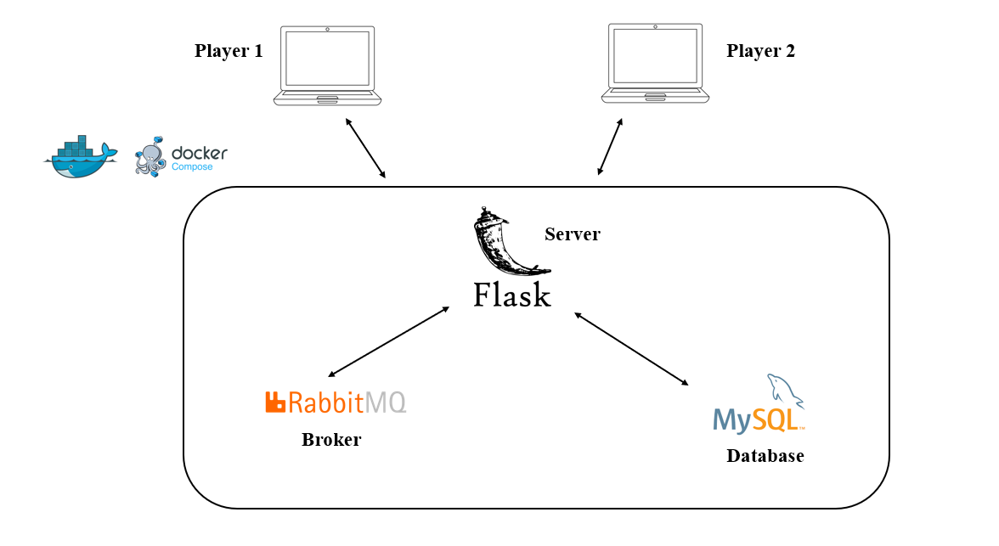

# DAMA-IT
To run the application, install docker and then execute docker-compose up  
Change the variablies in the .env file (you've to create it in the root directory) 
Change the IP Address of the RabbitMQ connection parameters with the IP address of your RabbitMQ container  
To navigate the web app, you have to look at localhost:5000  

  

