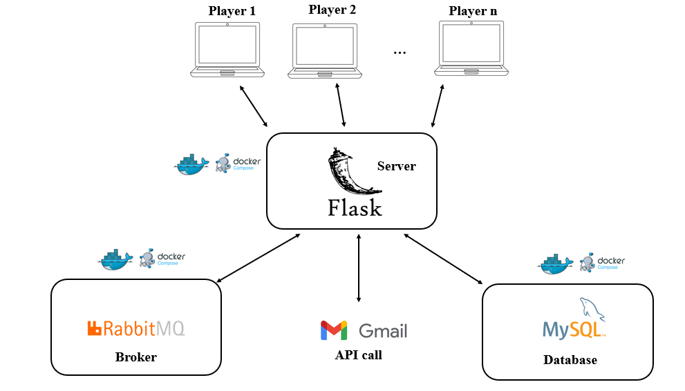

# DAMA-IT
# How to run the Application
 
  - be sure to have python installed on your device (if not it's suggested to install the latest version)  
  - be sure to have docker installed on your device (if not it's suggested to install the latest version)  
  - clone the repository (git clone [URL of the repo]>)
  - create in the root directory a file called .env that must be fullfilled as follows: 
      RABBITMQ_USERNAME=myuser
      RABBITMQ_PASSWORD=mypassword
      RABBITMQ_IP= ... [the IP address of your rabbit container in docker]
      MYSQL_USERNAME=root
      MYSQL_PASSWORD=root
      MYSQL_DB=db
      EMAIL= ... [the email address you want]
      EMAIL_PASSWORD= ... [the password of the email address]
  - navigate the imports in the client.py file and install all the libraries you've not installed yet
  - run the command [docker-compose up] to build up and run all the needed containers
  - run python ./client.py to start one client interface
 
what follows is an overview of what is in place once you've done all the steps above

  

